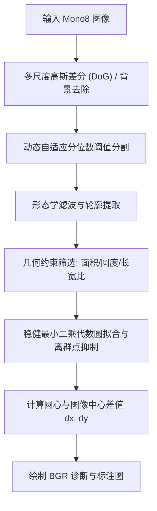

# 圆中心与图像中心差值计算接口实现计划

## 1. 需求与目标

在 `WaferCalibSDK` 中新增一个高鲁棒、抗干扰的圆中心检测与图像中心偏移（差值）计算接口：
1. **核心计算**：
   - 自动检测 Mono8 图像中的圆形目标（支持不同亮度、低对比度、光照不均与噪声干扰）；
   - 计算圆中心坐标 $(C_x, C_y)$ 与图像中心坐标 $(I_x, I_y)$；
   - 计算并输出 $X$ 与 $Y$ 方向的差值：
     $$\Delta X = C_x - I_x$$
     $$\Delta Y = C_y - I_y$$
2. **可视化标注**：
   - 标注圆的真实轮廓（黄色）；
   - 标注拟合圆形（青色）；
   - 标注圆中心（绿色十字）；
   - 标注图像中心（红色标记）；
   - 绘制图像中心到圆中心的连线（洋红色）；
   - 输出清晰的数值文本信息（$dx, dy, R$ 等）。
3. **模块与接口**：
   - C++ 模块类 `CircleCenterOffsetModule`；
   - C ABI 导出接口 `Wafer_FindCircleCenterOffset`；
   - 更新主头文件 `wafer_calib.hpp` 及 C API 头文件 `wafer_calib_c.h`；
   - 更新 C API 接口调用文档 `docs/WaferCalibSDK_C_API调用说明.md`；
   - 新增单元测试 `tests/test_circle_center_offset.cpp` 及示例 `samples/sample_circle_center_offset.cpp`。

---

## 2. 算法设计与鲁棒性保证

针对测试数据集 `images/求圆中心与图像中心的差值/20260822_0` 中 48 张实际图像（低对比度、背景噪声、亮度波动）的特点，算法采用多阶段稳健检测流程：



1. **多尺度高斯差分 (DoG)**：消除全局照明不均与暗角，同时抑制高频颗粒噪声，大幅增强圆边缘与前景响应。
2. **双极性自适应阈值**：兼顾亮圆与暗圆检测，采用动态分位数阈值自适应不同图像曝光与对比度。
3. **多重形状拓扑筛选**：结合面积门限、圆度（Circularity $\ge 0.6$）、惯性长宽比（Aspect Ratio $\le 1.3$）过滤各类非圆形伪特征。
4. **稳健亚像素/代数圆拟合**：采用最小二乘法拟合圆方程 $x^2 + y^2 + ax + by + c = 0$，计算 RMS 残差进一步剔除离群噪点，获得亚像素精度的圆心与半径。

---

## 3. 拟修改与新增文件

### 3.1 C++ 核心模块
- **[NEW]** [`include/wafer_calib/modules/circle_center_offset.hpp`](file:///d:/Projects/opencvProject/WaferCalibSDK/include/wafer_calib/modules/circle_center_offset.hpp)
  - 定义 `CircleDetectionResult` 结构体及 `CircleCenterOffsetModule` 类声明。
- **[NEW]** [`src/modules/circle_center_offset.cpp`](file:///d:/Projects/opencvProject/WaferCalibSDK/src/modules/circle_center_offset.cpp)
  - 实现圆检测、代数拟合、差值计算与诊断图像绘制。
- **[MODIFY]** [`include/wafer_calib/wafer_calib.hpp`](file:///d:/Projects/opencvProject/WaferCalibSDK/include/wafer_calib/wafer_calib.hpp)
  - 引入 `circle_center_offset.hpp` 头文件。

### 3.2 C ABI 导出层
- **[MODIFY]** [`include/wafer_calib/c_api/wafer_calib_c.h`](file:///d:/Projects/opencvProject/WaferCalibSDK/include/wafer_calib/c_api/wafer_calib_c.h)
  - 声明 `Wafer_FindCircleCenterOffset` 接口，提供详尽的 Doxygen 中文注释。
- **[MODIFY]** [`src/c_api/wafer_calib_c.cpp`](file:///d:/Projects/opencvProject/WaferCalibSDK/src/c_api/wafer_calib_c.cpp)
  - 实现 `Wafer_FindCircleCenterOffset` 的 C-to-C++ 适配与参数校验。

### 3.3 测试与示例
- **[NEW]** [`tests/test_circle_center_offset.cpp`](file:///d:/Projects/opencvProject/WaferCalibSDK/tests/test_circle_center_offset.cpp)
  - 针对 `20260822_0` 目录下的 48 张真实图像进行批量自动化测试，验证检测成功率达到 100% 且运行时间在百毫秒以内。
- **[NEW]** [`samples/sample_circle_center_offset.cpp`](file:///d:/Projects/opencvProject/WaferCalibSDK/samples/sample_circle_center_offset.cpp)
  - 演示如何调用 C API 与 C++ API，并保存输出标注图。
- **[MODIFY]** [`CMakeLists.txt`](file:///d:/Projects/opencvProject/WaferCalibSDK/CMakeLists.txt)
  - 添加 `test_circle_center_offset` 测试工程目标。

### 3.4 开发文档与调用说明
- **[MODIFY]** [`docs/WaferCalibSDK_C_API调用说明.md`](file:///d:/Projects/opencvProject/WaferCalibSDK/docs/WaferCalibSDK_C_API%E8%B0%83%E7%94%A8%E8%AF%B4%E6%98%8E.md)
  - 新增 `Wafer_FindCircleCenterOffset` 接口章节，包含接口说明、参数表格、C# P/Invoke 签名和调用示例。

---

## 4. 验证计划

### 4.1 自动化测试
- 运行 CMake 构建 SDK 动态库与测试程序：
  ```powershell
  cmake --build build --config Release
  ```
- 运行 `build/Release/test_circle_center_offset.exe`，验证：
  1. 所有 48 张图像（324.bmp ~ 371.bmp）100% 检测成功；
  2. 半径拟合标准差 $\le 0.15$ 像素；
  3. $dx, dy$ 连续平滑无跳变；
  4. 每张图处理耗时 $< 100$ ms。

### 4.2 诊断图像核验
- 检查生成的标注图（`result_bgr`）：
  - 图像中心十字与标注文本位置准确；
  - 圆轮廓与拟合圆吻合；
  - 圆中心十字准确落在圆心；
  - 连线与差值文本信息清晰规范。
