# WaferCalibSDK 视觉算法库接口与开发指南

本文档面向自动化机台控制软件、上层 C# (.NET) 视觉检测软件及 C++ 开发者，系统阐述 `WaferCalibSDK.dll` 各核心视觉功能模块的技术原理、调用流程、接口参数及示例代码。

---

## 目录

- [一、 通用约定与基础规范](#一-通用约定与基础规范)
  - [1.1 图像格式与内存对齐](#11-图像格式与内存对齐)
  - [1.2 SDK 状态返回码](#12-sdk-状态返回码)
  - [1.3 C# P/Invoke 原生互操作基类定义](#13-c-pinvoke-原生互操作基类定义)
  - [1.4 工业相机采集内存传递规范](#14-工业相机采集内存传递规范)
- [二、 暗场背景降噪功能 (NoiseReduction)](#二-暗场背景降噪功能-noisereduction)
  - [2.1 业务场景与技术原理](#21-业务场景与技术原理)
  - [2.2 核心接口说明 (Wafer_CreateDarkFrameTemplate)](#22-核心接口说明-wafer_createdarkframetemplate)
  - [2.3 C# 调用代码示例](#23-c-调用代码示例)
  - [2.4 实测效果展示](#24-实测效果展示)
- [三、 四十字 Mark 对角线交点定位功能 (MarkCenter)](#三-四十字-mark-对角线交点定位功能-markcenter)
  - [3.1 业务场景与技术原理](#31-业务场景与技术原理)
  - [3.2 核心接口说明 (Wafer_FindFourCrossMarkCenter)](#32-核心接口说明-wafer_findfourcrossmarkcenter)
  - [3.3 C# 调用代码示例](#33-c-调用代码示例)
  - [3.4 实测效果展示](#34-实测效果展示)
- [四、 水平标定线角度检测功能 (LineAngle)](#四-水平标定线角度检测功能-lineangle)
  - [4.1 业务场景与技术原理](#41-业务场景与技术原理)
  - [4.2 核心接口说明 (Wafer_FindHorizontalLineAngle)](#42-核心接口说明-wafer_findhorizontallineangle)
  - [4.3 C# 调用代码示例](#43-c-调用代码示例)
  - [4.4 实测效果展示](#44-实测效果展示)
- [五、 镜头畸变校正功能 (DistortionCorrection)](#五-镜头畸变校正功能-distortioncorrection)
  - [5.1 业务场景与技术架构](#51-业务场景与技术架构)
  - [5.2 核心数据结构：WaferDotGridDistortionTemplate](#52-核心数据结构waferdotgriddistortiontemplate)
  - [5.3 业务调用流程与设计逻辑 (离线标定 vs 在线生产)](#53-业务调用流程与设计逻辑-离线标定-vs-在线生产)
  - [5.4 接口定义与参数详解](#54-接口定义与参数详解)
    - [1. Wafer_CreateDotGridDistortionTemplate (单视野标定)](#1-wafer_createdotgriddistortiontemplate-单视野标定)
    - [2. Wafer_CreateMultiViewDotGridDistortionTemplate (5视野联合标定)](#2-wafer_createmultiviewdotgriddistortiontemplate-5视野联合标定)
    - [3. Wafer_SaveDistortionTemplateToFile (标定配方持久化保存)](#3-wafer_savedistortiontemplatetofile-标定配方持久化保存)
    - [4. Wafer_LoadDistortionTemplateFromFile (标定配方持久化载入)](#4-wafer_loaddistortiontemplatefromfile-标定配方持久化载入)
    - [5. Wafer_CorrectImageByDotGridTemplate (图像实时高速畸变校正)](#5-wafer_correctimagebydotgridtemplate-图像实时高速畸变校正)
  - [5.5 C# 完整端到端调用示例](#55-c-完整端到端调用示例)
  - [5.6 实测标定与校正效果展示](#56-实测标定与校正效果展示)
- [六、 晶圆圆中心与图像中心差值功能 (CircleCenterOffset)](#六-晶圆圆中心与图像中心差值功能-circlecenteroffset)
  - [6.1 业务场景与技术原理](#61-业务场景与技术原理)
  - [6.2 核心接口说明 (Wafer_FindCircleCenterOffset)](#62-核心接口说明-wafer_findcirclecenteroffset)
  - [6.3 C# 调用代码示例](#63-c-调用代码示例)
  - [6.4 实测效果展示](#64-实测效果展示)
- [七、 平台旋转中心计算功能 (RotationCenter)](#七-平台旋转中心计算功能-rotationcenter)
  - [7.1 业务场景与旋转采样点数工程选型](#71-业务场景与旋转采样点数工程选型)
  - [7.2 核心数据结构：WaferPlatformRotationCenterResult](#72-核心数据结构waferplatformrotationcenterresult)
  - [7.3 核心接口说明 (Wafer_CalculatePlatformRotationCenter)](#73-核心接口说明-wafer_calculateplatformrotationcenter)
  - [7.4 C# 调用代码示例](#74-c-调用代码示例)
  - [7.5 实测拟合大结果图展示](#75-实测拟合大结果图展示)
- [八、 反射率光电响应标定与灰度线性化 LUT 功能 (ReflectanceLut)](#八-反射率光电响应标定与灰度线性化-lut-功能-reflectancelut)
  - [8.1 业务场景与物理基准原理](#81-业务场景与物理基准原理)
  - [8.2 核心数据结构：WaferReflectanceLutConfig 与 WaferReflectanceLutResult](#82-核心数据结构waferreflectancelutconfig-与-waferreflectancelutresult)
  - [8.3 核心接口说明 (Wafer_CalibrateReflectanceLut 与 Wafer_ApplyLutToImage)](#83-核心接口说明-wafer_calibratereflectancelut-与-wafer_applyluttoimage)
  - [8.4 C# 调用代码示例](#84-c-调用代码示例)
  - [8.5 实测标定与综合诊断大图展示](#85-实测标定与综合诊断大图展示)
- [附录：C++ 原生模块架构参考](#附录c-原生模块架构参考)

---

## 一、 通用约定与基础规范

### 1.1 图像格式与内存对齐

- **输入图像格式**：全算法模块均针对工业灰度相机设计，输入数据为标准 **Mono8**（灰度图，单通道 8 位，`CV_8UC1`），每个像素占用 1 字节。
- **图像行对齐与步长**：图像内存必须为连续紧凑存储，行步长（Step / Stride）固定等于图像宽度 `width`。
- **缓冲区大小分配**：
  - Mono8 输入/输出图像：缓冲区最小长度为 `width * height` 字节。
  - 普通单图诊断/标注彩色结果图（`result_bgr`）：缓冲区最小长度为 `width * height * 3` 字节，像素排列遵循标准 **BGR** 顺序（每个像素依次为 Blue、Green、Red）。
  - **5视野联合标定诊断大图 (`result_bgr`)**：因输出为 **3*3 空间拓扑无损拼接大图**，输出分辨率为 `(width * 3) * (height * 3)`，所需缓冲区最小长度为 **`(width * 3) * (height * 3) * 3` 字节**。
- **内存生命周期原则**：所有由接口传出的图像缓冲区、模板结构体均由**调用方（上层应用）预先分配与释放**。SDK 内部绝不在堆上为输出图像重新申请内存，杜绝内存泄漏隐患。

### 1.2 SDK 状态返回码

所有 C API 函数的整型返回值均表示执行状态：

| 错误码常量 | 数值 | 含义说明 | 上层应用排查与处理建议 |
|---|---:|---|---|
| `WAFER_SUCCESS` | 0 | 执行成功 | 可正常读取输出数据或输出图像。 |
| `WAFER_ERR_INVALID_PARAM` | 1 | 参数无效 | 检查是否传入了空指针（`IntPtr.Zero`）、负数宽高、不支持的算法模式或超出合法范围的参数。 |
| `WAFER_ERR_IMAGE_EMPTY` | 2 | 图像为空 | 检查图像指针是否为 NULL 或长度为 0。 |
| `WAFER_ERR_FORMAT_MISMATCH` | 3 | 尺寸或格式不匹配 | 确保校正图像尺寸与畸变模板中的 `image_width` / `image_height` 严格相等。 |
| `WAFER_ERR_FEATURE_NOT_FOUND` | 4 | 未识别到特征 | 标定板未入画、曝光过暗/过曝、对比度不足，或特征圆/十字被遮挡。 |
| `WAFER_ERR_FITTING_FAILED` | 5 | 几何数学拟合失败 | 有效特征点过少（少于 10 个），导致多项式或直线最小二乘求解奇异。 |
| `WAFER_ERR_FILE_IO` | 6 | 文件读写失败 | 检查目标路径是否存在、是否具备写入权限或配方文件是否已损坏。 |
| `WAFER_ERR_UNKNOWN` | 999 | 未分类异常 | 内部未捕获的严重异常，请检查底层运行日志。 |

> **调用准则**：在读取输出参数（如坐标、角度、校正图）之前，**必须首先断言返回值等于 0 (`WAFER_SUCCESS`)**。

### 1.3 C# P/Invoke 原生互操作基类定义

在 C# 客户端项目中，建议统一封装一个名为 `WaferCalibNative.cs` 的静态互操作类（已剔除任何基于文件路径的接口，纯内存流交互）：

```csharp
using System;
using System.Runtime.InteropServices;

namespace WaferVisionSystem.Interop {
    /// <summary>
    /// WaferCalibSDK 原生 C API P/Invoke 声明类
    /// </summary>
    public static class WaferCalibNative {
        public const string DllName = "WaferCalibSDK.dll";

        // 状态码常量
        public const int WAFER_SUCCESS = 0;
        public const int WAFER_ERR_INVALID_PARAM = 1;
        public const int WAFER_ERR_IMAGE_EMPTY = 2;
        public const int WAFER_ERR_FORMAT_MISMATCH = 3;
        public const int WAFER_ERR_FEATURE_NOT_FOUND = 4;
        public const int WAFER_ERR_FITTING_FAILED = 5;
        public const int WAFER_ERR_FILE_IO = 6;
        public const int WAFER_ERR_UNKNOWN = 999;

        // 畸变多项式映射系数数量 (三阶 2D 多项式固定为 10)
        public const int PolynomialCoefficientCount = 10;

        /// <summary>
        /// 畸变校正模板结构体 (与 C 结构体 WaferDotGridDistortionTemplate 顺序和字节严格对齐)
        /// </summary>
        [StructLayout(LayoutKind.Sequential)]
        public struct WaferDotGridDistortionTemplate {
            public int ImageWidth;
            public int ImageHeight;

            [MarshalAs(UnmanagedType.ByValArray, SizeConst = PolynomialCoefficientCount)]
            public double[] OutputToInputX;

            [MarshalAs(UnmanagedType.ByValArray, SizeConst = PolynomialCoefficientCount)]
            public double[] OutputToInputY;

            public int DetectedPointCount;
            public double RmsErrorPixels;
        }

        // ================= 各业务功能接口 P/Invoke 声明 =================

        // 1. 暗场背景降噪
        [DllImport(DllName, CallingConvention = CallingConvention.Cdecl)]
        public static extern int Wafer_CreateDarkFrameTemplate(
            IntPtr[] frameBuffers,
            int frameCount,
            IntPtr outDarkTemplate,
            int width,
            int height,
            int method
        );

        // 2. 四十字 Mark 对角线交点定位
        [DllImport(DllName, CallingConvention = CallingConvention.Cdecl)]
        public static extern int Wafer_FindFourCrossMarkCenter(
            IntPtr imageBuffer,
            int width,
            int height,
            out double calculatedCenterX,
            out double calculatedCenterY,
            IntPtr resultBgr
        );

        // 3. 水平标定线角度检测
        [DllImport(DllName, CallingConvention = CallingConvention.Cdecl)]
        public static extern int Wafer_FindHorizontalLineAngle(
            IntPtr imageBuffer,
            int width,
            int height,
            out double angleDegrees,
            IntPtr resultBgr
        );

        // 4.1 畸变校正 - 单视野点阵标定
        [DllImport(DllName, CallingConvention = CallingConvention.Cdecl)]
        public static extern int Wafer_CreateDotGridDistortionTemplate(
            IntPtr calibrationImageBuffer,
            int width,
            int height,
            int gridColumns,
            int gridRows,
            double pointSpacingMm,
            ref WaferDotGridDistortionTemplate outTemplate,
            IntPtr resultBgr
        );

        // 4.2 畸变校正 - 5视野联合多点位点阵标定
        [DllImport(DllName, CallingConvention = CallingConvention.Cdecl)]
        public static extern int Wafer_CreateMultiViewDotGridDistortionTemplate(
            IntPtr[] imageBuffers,
            int width,
            int height,
            int gridColumns,
            int gridRows,
            double pointSpacingMm,
            double stageStepMm,
            ref WaferDotGridDistortionTemplate outTemplate,
            IntPtr resultBgr
        );

        // 4.3 畸变校正 - 标定模板持久化保存到文件
        [DllImport(DllName, CallingConvention = CallingConvention.Cdecl, CharSet = CharSet.Ansi)]
        public static extern int Wafer_SaveDistortionTemplateToFile(
            string filePath,
            ref WaferDotGridDistortionTemplate distortionTemplate
        );

        // 4.4 畸变校正 - 从文件加载已标定的模板
        [DllImport(DllName, CallingConvention = CallingConvention.Cdecl, CharSet = CharSet.Ansi)]
        public static extern int Wafer_LoadDistortionTemplateFromFile(
            string filePath,
            ref WaferDotGridDistortionTemplate outTemplate
        );

        // 4.5 畸变校正 - 图像高速畸变校正 (生产在线)
        [DllImport(DllName, CallingConvention = CallingConvention.Cdecl)]
        public static extern int Wafer_CorrectImageByDotGridTemplate(
            IntPtr imageBuffer,
            int width,
            int height,
            ref WaferDotGridDistortionTemplate distortionTemplate,
            IntPtr correctedMono8
        );

        // 5. 晶圆圆中心与图像中心差值
        [DllImport(DllName, CallingConvention = CallingConvention.Cdecl)]
        public static extern int Wafer_FindCircleCenterOffset(
            IntPtr imageBuffer,
            int width,
            int height,
            out double offsetX,
            out double offsetY,
            IntPtr resultBgr
        );

        // 平台旋转中心最大支持点数
        public const int MaxRotationCenterPoints = 36;

        /// <summary>
        /// 平台旋转中心计算结果结构体 (与 C 结构体 WaferPlatformRotationCenterResult 内存对齐)
        /// </summary>
        [StructLayout(LayoutKind.Sequential)]
        public struct WaferPlatformRotationCenterResult {
            public double CenterX;
            public double CenterY;
            public double Radius;
            public double RmsError;
            public double MaxError;
            public int ValidPointCount;

            [MarshalAs(UnmanagedType.ByValArray, SizeConst = MaxRotationCenterPoints)]
            public double[] PointX;

            [MarshalAs(UnmanagedType.ByValArray, SizeConst = MaxRotationCenterPoints)]
            public double[] PointY;

            [MarshalAs(UnmanagedType.ByValArray, SizeConst = MaxRotationCenterPoints)]
            public double[] PointResidual;
        }

        // 6. 平台旋转中心计算
        [DllImport(DllName, CallingConvention = CallingConvention.Cdecl)]
        public static extern int Wafer_CalculatePlatformRotationCenter(
            IntPtr[] imageBuffers,
            int imageCount,
            int width,
            int height,
            ref WaferPlatformRotationCenterResult outResult,
            IntPtr resultBgr
        );

        /// <summary>
        /// 反射率光电响应标定配置结构体
        /// </summary>
        [StructLayout(LayoutKind.Sequential)]
        public struct WaferReflectanceLutConfig {
            public int LutMode;              // 0: 分段阶梯死区模式; 1: 单调平滑样条模式(PCHIP)
            public int RoiCenterWidth;       // 中心测量 ROI 宽度 (像素)，0 表示全幅
            public int RoiCenterHeight;      // 中心测量 ROI 高度 (像素)，0 表示全幅
            public int DeadbandWidth;        // 死区半宽 (像素灰度级，默认 5)

            [MarshalAs(UnmanagedType.ByValArray, SizeConst = 4)]
            public double[] TargetValues;    // 目标物理基准灰度 [13, 128, 192, 230]
        }

        /// <summary>
        /// 反射率光电响应标定结果结构体
        /// </summary>
        [StructLayout(LayoutKind.Sequential)]
        public struct WaferReflectanceLutResult {
            [MarshalAs(UnmanagedType.ByValArray, SizeConst = 256)]
            public byte[] Lut;               // 256 元素灰度映射查找表

            [MarshalAs(UnmanagedType.ByValArray, SizeConst = 4)]
            public double[] MeasuredPeaks;   // 实测波峰灰度值

            [MarshalAs(UnmanagedType.ByValArray, SizeConst = 4)]
            public double[] TargetValues;    // 标定使用的目标基准值

            public double RawLinearityR2;    // 校正前非线性 R^2
            public double CorrectedLinearityR2; // 校正后线性 R^2
        }

        // 7. 反射率光电响应标定与 LUT 生成 (离线标定)
        [DllImport(DllName, CallingConvention = CallingConvention.Cdecl)]
        public static extern int Wafer_CalibrateReflectanceLut(
            IntPtr[] imageBuffers,
            int width,
            int height,
            ref WaferReflectanceLutConfig config,
            ref WaferReflectanceLutResult outResult,
            IntPtr resultBgr
        );

        // 8. 单帧图像高速查表线性化校正 (在线生产, 每帧 ~0.5ms)
        [DllImport(DllName, CallingConvention = CallingConvention.Cdecl)]
        public static extern int Wafer_ApplyLutToImage(
            IntPtr srcMono8,
            int width,
            int height,
            byte[] lut256,
            IntPtr dstMono8
        );

        // 9. LUT 配方文件保存与载入
        [DllImport(DllName, CallingConvention = CallingConvention.Cdecl, CharSet = CharSet.Ansi)]
        public static extern int Wafer_SaveLutToFile(string filePath, byte[] lut256);

        [DllImport(DllName, CallingConvention = CallingConvention.Cdecl, CharSet = CharSet.Ansi)]
        public static extern int Wafer_LoadLutFromFile(string filePath, byte[] lut256);
    }
}
```

### 1.4 工业相机采集内存传递规范

在主流工业相机 SDK（如海康 MVS、大恒 Galaxy、巴斯勒 Pylon 等）的回调函数中，相机的原始数据指针为非托管指针 `IntPtr`。
- **零拷贝直传（推荐）**：可直接将相机回调提供的 `pFrameInfo.pBufAddr` 或 `IntPtr` 传入 `WaferCalibSDK`，无需通过 `Marshal.Copy` 复制到托管 `byte[]` 中，最大限度节省 CPU 内存带宽与 GC 压力。
- **托管数组传递**：若图像已在 C# `byte[]` 数组中，可使用 `GCHandle.Alloc(bytes, GCHandleType.Pinned)` 固定句柄后获取其指针，调用结束后必须调用 `handle.Free()` 释放。

---

## 二、 暗场背景降噪功能 (NoiseReduction)

### 2.1 业务场景与技术原理

在半导体晶圆微观缺陷检测与高精度对准中，CIS/CCD 图像传感器受热噪声、暗电流不均匀性及暗信号非均匀性（DSNU/FPN）影响，在无光照射或微光背景下存在固定底噪，降低弱边缘对比度。

该功能将相机在遮光闭光环境下连续采集的 $N$ 帧暗场图像进行统计学合成，建立高信噪比的背景降噪基准模板（Dark Frame Template）。

### 2.2 核心接口说明 (Wafer_CreateDarkFrameTemplate)

```c
int Wafer_CreateDarkFrameTemplate(
    const unsigned char** frame_buffers,
    int frame_count,
    unsigned char* out_dark_template,
    int width,
    int height,
    int method
);
```

#### 参数详解

| 参数名 | 传递方向 | 数据类型 | 说明 |
|---|---|---|---|
| `frame_buffers` | 输入 | `const unsigned char**` | 包含 `frame_count` 个指向 Mono8 图像首地址的指针数组。每帧内存大小为 `width * height` 字节。 |
| `frame_count` | 输入 | `int` | 参与合成的暗场图像帧数，通常建议 8~32 帧以获得最佳信噪比。 |
| `out_dark_template` | 输出 | `unsigned char*` | 调用方预先分配的输出模板缓冲区，大小为 `width * height` 字节。 |
| `width` | 输入 | `int` | 图像宽度（像素）。 |
| `height` | 输入 | `int` | 图像高度（像素）。 |
| `method` | 输入 | `int` | 合成算法策略：<br>• `0`: **平均值法 (Mean)**，平滑高斯白噪声最快；<br>• `1`: **中值滤波法 (Median)**，强力剔除传感器随机坏点和脉冲散粒噪声；<br>• `2`: **3-Sigma 剔除均值法 (Truncated Mean)**，半导体级最高精度合成。 |

### 2.3 C# 调用代码示例

```csharp
using System;
using System.Runtime.InteropServices;
using WaferVisionSystem.Interop;

public class NoiseReductionDemo {
    public static void GenerateDarkTemplate(IntPtr[] cameraDarkFrames, int width, int height) {
        int frameCount = cameraDarkFrames.Length;
        int bufferSize = width * height;
        IntPtr outTemplatePtr = Marshal.AllocHGlobal(bufferSize);

        try {
            // 使用 3-Sigma 剔除均值法 (method = 2) 合成高质量暗场底模
            int ret = WaferCalibNative.Wafer_CreateDarkFrameTemplate(
                cameraDarkFrames,
                frameCount,
                outTemplatePtr,
                width,
                height,
                2
            );

            if (ret != WaferCalibNative.WAFER_SUCCESS) {
                throw new Exception($"暗场模板合成失败，错误码: {ret}");
            }

            // 读取合成出的 Mono8 模板数据 (可持久化保存为标定底图)
            byte[] darkTemplateBytes = new byte[bufferSize];
            Marshal.Copy(outTemplatePtr, darkTemplateBytes, 0, bufferSize);
            Console.WriteLine("暗场模板生成成功！");
        } finally {
            Marshal.FreeHGlobal(outTemplatePtr);
        }
    }
}
```

### 2.4 实测效果展示

| 输入单帧暗场原始图像 | 输出统计合成降噪模板 |
|:---:|:---:|
|  |  |
| *可见传感器固有固定模式噪声与暗电流斑驳条纹* | *通过多帧 3-Sigma 剔除平滑后的干净基准底模* |

---

## 三、 四十字 Mark 对角线交点定位功能 (MarkCenter)

### 3.1 业务场景与技术原理

在晶圆切割、划片、光刻与粗对准工步中，载片台四角或特定视场布置有四个高反差十字 Mark。为了建立晶圆全局坐标基准，需定位该四个十字 Mark 并计算其两组空间对角线的几何中心交点。

算法流程包含：
1. 自适应阈值分割与十字几何拓扑筛选；
2. 亚像素轮廓边缘提取与角点重心亚像素精定位；
3. 空间拓扑分配：自动识别左上、右上、左下、右下四个 Mark；
4. 求解对角线 $L_1(P_{TL}, P_{BR})$ 与 $L_2(P_{TR}, P_{BL})$ 的解析几何交点 $(C_x, C_y)$。

### 3.2 核心接口说明 (Wafer_FindFourCrossMarkCenter)

```c
int Wafer_FindFourCrossMarkCenter(
    const unsigned char* image_buffer,
    int width,
    int height,
    double* calculated_center_x,
    double* calculated_center_y,
    unsigned char* result_bgr
);
```

#### 参数详解

| 参数名 | 传递方向 | 数据类型 | 说明 |
|---|---|---|---|
| `image_buffer` | 输入 | `const unsigned char*` | 输入 Mono8 图像指针，长度为 `width * height` 字节。 |
| `width` | 输入 | `int` | 图像宽度（像素）。 |
| `height` | 输入 | `int` | 图像高度（像素）。 |
| `calculated_center_x` | 输出 | `double*` | 两对角线交点的亚像素 X 坐标（以图像左上角为原点）。 |
| `calculated_center_y` | 输出 | `double*` | 两对角线交点的亚像素 Y 坐标（以图像左上角为原点）。 |
| `result_bgr` | 输出 | `unsigned char*` | 输出 BGR 彩色标注图缓冲区（大小为 `width * height * 3` 字节），包含十字标记框、对角线与中心交点十字标注。传 NULL 表示不输出。 |

### 3.3 C# 调用代码示例

```csharp
using System;
using System.Runtime.InteropServices;
using WaferVisionSystem.Interop;

public class MarkCenterDemo {
    public static void LocateWaferMarkCenter(IntPtr imageBuffer, int width, int height) {
        int bgrSize = width * height * 3;
        IntPtr resultBgrPtr = Marshal.AllocHGlobal(bgrSize);

        try {
            int ret = WaferCalibNative.Wafer_FindFourCrossMarkCenter(
                imageBuffer,
                width,
                height,
                out double centerX,
                out double centerY,
                resultBgrPtr
            );

            if (ret != WaferCalibNative.WAFER_SUCCESS) {
                throw new Exception($"十字 Mark 定位失败，错误码: {ret}");
            }

            Console.WriteLine($"四十字 Mark 对角线交点亚像素坐标: X = {centerX:F3}, Y = {centerY:F3}");
            // 可将 resultBgrPtr 的 BGR 数据送入 UI 控件进行画面实时渲染呈现
        } finally {
            Marshal.FreeHGlobal(resultBgrPtr);
        }
    }
}
```

### 3.4 实测效果展示

| 输入晶圆四十字 Mark 图像 | 输出亚像素标注与对角线交点诊断图 |
|:---:|:---:|
|  |  |
| *含有 4 个高对比度十字标记点的晶圆微观原图* | *精确定位 4 个十字亚像素中心，绘制对角线并求出交点坐标* |

---

## 四、 水平标定线角度检测功能 (LineAngle)

### 4.1 业务场景与技术原理

半导体晶圆通常具备平边（Flat）或基准直边，机械手臂在抓取放置后存在微小旋转安装偏角 $\theta$。为了实现晶圆角度自动对正，需要高精度测量该参考直线的水平倾角。

算法通过高精度梯度边缘检测子采样提取直线上数百个亚像素边缘点，结合 RANSAC 鲁棒直线回归拟合算法，输出物理角度值 $\theta$（角度精度优于 $\pm 0.005^\circ$）。

**角度坐标系定义**：
- 范围：$[-90.0^\circ, 90.0^\circ)$；
- 水平基准：完美水平线角度为 $0.0^\circ$；
- 符号规则：直线从左至右**向下倾斜为正角度 ($+$)**，从左至右**向上翘起为负角度 ($-$)**。

### 4.2 核心接口说明 (Wafer_FindHorizontalLineAngle)

```c
int Wafer_FindHorizontalLineAngle(
    const unsigned char* image_buffer,
    int width,
    int height,
    double* angle_degrees,
    unsigned char* result_bgr
);
```

#### 参数详解

| 参数名 | 传递方向 | 数据类型 | 说明 |
|---|---|---|---|
| `image_buffer` | 输入 | `const unsigned char*` | 输入 Mono8 图像指针，长度为 `width * height` 字节。 |
| `width` | 输入 | `int` | 图像宽度（像素）。 |
| `height` | 输入 | `int` | 图像高度（像素）。 |
| `angle_degrees` | 输出 | `double*` | 检测到的直线水平偏角，单位为度（Degree）。 |
| `result_bgr` | 输出 | `unsigned char*` | 输出 BGR 彩色标注图缓冲区（`width * height * 3` 字节），包含采样边缘点集与拟合参考线。传 NULL 表示不输出。 |

### 4.3 C# 调用代码示例

```csharp
using System;
using System.Runtime.InteropServices;
using WaferVisionSystem.Interop;

public class LineAngleDemo {
    public static double MeasureWaferRotation(IntPtr imageBuffer, int width, int height) {
        int bgrSize = width * height * 3;
        IntPtr resultBgrPtr = Marshal.AllocHGlobal(bgrSize);

        try {
            int ret = WaferCalibNative.Wafer_FindHorizontalLineAngle(
                imageBuffer,
                width,
                height,
                out double angleDeg,
                resultBgrPtr
            );

            if (ret != WaferCalibNative.WAFER_SUCCESS) {
                throw new Exception($"水平线角度检测失败，错误码: {ret}");
            }

            Console.WriteLine($"检测到晶圆基准线倾角: {angleDeg:F4}° (旋转平台需反向补偿 {-angleDeg:F4}°)");
            return angleDeg;
        } finally {
            Marshal.FreeHGlobal(resultBgrPtr);
        }
    }
}
```

### 4.4 实测效果展示

| 水平基准线提取与高精度角度检测诊断图 |
|:---:|
|  |
| *绿线为 RANSAC 鲁棒拟合直线，实时输出极小微米级倾角偏差* |

---

## 五、 镜头畸变校正功能 (DistortionCorrection)

### 5.1 业务场景与技术架构

高倍率远心镜头与显微镜头普遍存在枕形、桶形光学畸变，导致图像边缘尺寸拉伸或压缩，严重影响亚微米级量测精度。

本 SDK 提供基于高阶二维多项式的反畸变模型：
- **单视野标定 (`Wafer_CreateDotGridDistortionTemplate`)**：适用于标定板尺寸大于相机视野（标定板能充满整个图像像面）的标准工况。
- **5视野联合标定 (`Wafer_CreateMultiViewDotGridDistortionTemplate`)**：适用于相机视野较大、标定板尺寸无法覆盖全视野的微观场景。在相机位置固定的前提下，通过载有标定板的平台平移至**左上、左下、右上、右下、中心** 5 个点位进行拍摄，由算法自动识别白圆与特征圆、对齐外参并联合优化，生成全局单一校正模板。

### 5.2 核心数据结构：WaferDotGridDistortionTemplate

```c
typedef struct WaferDotGridDistortionTemplate {
    int image_width;
    int image_height;
    double output_to_input_x[10];
    double output_to_input_y[10];
    int detected_point_count;
    double rms_error_pixels;
} WaferDotGridDistortionTemplate;
```

#### 字段物理意义

| 结构体字段 | 数据类型 | 物理含义 | 在线生产校正时是否使用 |
|---|---|---|:---:|
| `image_width` | `int` | 标定时的图像宽度（像素）。用于安全性校验，防止模板被错用于不同分辨率相机。 | **是** |
| `image_height` | `int` | 标定时的图像高度（像素）。 | **是** |
| `output_to_input_x[10]` | `double[10]` | 二维三阶反向映射多项式在 X 方向的 10 个解算系数。 | **是** |
| `output_to_input_y[10]` | `double[10]` | 二维三阶反向映射多项式在 Y 方向的 10 个解算系数。 | **是** |
| `detected_point_count` | `int` | 参与标定拟合的总有效特征圆点数。 | 否 (仅供记录) |
| `rms_error_pixels` | `double` | 标定点阵的全局均方根拟合残差（RMS Error，单位像素），用于评定镜头标定质量（一般应小于 0.25 像素）。 | 否 (仅供记录) |

> **数学多项式映射模型**：
> 设校正后输出归一化坐标为 $(u, v) \in [0, 1]^2$，则原始输入畸变坐标 $(x, y)$ 通过以下 10 项三阶多项式求得：
> $$x = a_0 + a_1 u + a_2 v + a_3 u^2 + a_4 uv + a_5 v^2 + a_6 u^3 + a_7 u^2v + a_8 uv^2 + a_9 v^3$$
> $$y = b_0 + b_1 u + b_2 v + b_3 u^2 + b_4 uv + b_5 v^2 + b_6 u^3 + b_7 u^2v + b_8 uv^2 + b_9 v^3$$

### 5.3 业务调用流程与设计逻辑 (离线标定 vs 在线生产)

工业产线视觉系统的工作流程严格划分为**离线标定阶段**与**在线高速生产校正阶段**：

```mermaid
flowchart TD
    subgraph Phase1["阶段一：离线标定工步 (设备组装 / 定期维保 / 换型时执行一次)"]
        A1[确定标定板与视野覆盖情况] --> B1{标定板能否充满视野?}
        B1 -- 能充满 --> C1[采集单张点阵图]
        C1 --> D1["Wafer_CreateDotGridDistortionTemplate\n(单视野标定)"]
        B1 -- 视野大/无法充满 --> C2["平台移动至左上、左下、右上、右下、中心 5 个点位采集 5 张图像"]
        C2 --> D2["Wafer_CreateMultiViewDotGridDistortionTemplate\n(5视野联合标定)"]
        D1 --> E1[生成全局唯一 WaferDotGridDistortionTemplate 模板]
        D2 --> E1
        E1 --> F1["Wafer_SaveDistortionTemplateToFile\n(持久化保存为配方文件 *.bin / *.json)"]
    end

    subgraph Phase2["阶段二：在线生产高速校正工步 (实时生产检测，持续高频执行)"]
        A2[产线启动 / 载入生产品种配方] --> B2["Wafer_LoadDistortionTemplateFromFile\n(从磁盘配方文件载入模板，耗时 < 1ms)"]
        B2 --> C3[相机连续触发拍照获取 Mono8 原始图像]
        C3 --> D3["Wafer_CorrectImageByDotGridTemplate\n(高速重映射校正，微秒级消除畸变)"]
        D3 --> E3[输出无畸变图像给后续高精度量测与对位模块]
        E3 --> C3
    end
```



#### 5 视野联合标定算法逻辑拆解
1. **高信噪比亚像素圆心提取**：采用顶帽变换（Top-Hat）消除大视场光照不均匀，结合轮廓重心与椭圆拟合，亚像素提取图像中发白大圆；
2. **中心标记圆自动识别与拓扑索引**：自动定位标定板第 101 个中心特征圆，自适应恢复完整的 $10 \times 10$ 点阵行列物理网格索引；
3. **SVD 外参刚体初值估计**：利用视野重叠区域的对应特征点集，通过 SVD 奇异值分解自动解算各视野相对于中心视野的刚体变换初值；
4. **全局非线性联合优化**：构建全像面特征点集合，以最小化像面重投影残差为目标，求解全局单一多项式模型；
5. **无损全画幅 3x3 拼接诊断图**：将 5 视野原图按照物理移动拓扑无损拼接入 3x3 大图中，各自独立标注圆点与网格编号，直观展示全像面边缘覆盖度。

### 5.4 接口定义与参数详解

#### 1. Wafer_CreateDotGridDistortionTemplate (单视野标定)

从单张规则圆点阵 Mono8 图像建立固定视野畸变校正模板。

```c
int Wafer_CreateDotGridDistortionTemplate(
    const unsigned char* calibration_image_buffer,
    int width,
    int height,
    int grid_columns,
    int grid_rows,
    double point_spacing_mm,
    WaferDotGridDistortionTemplate* out_template,
    unsigned char* result_bgr
);
```

| 参数名 | 传递方向 | 数据类型 | 说明 |
|---|---|---|---|
| `calibration_image_buffer` | 输入 | `const unsigned char*` | 标定点阵 Mono8 图像首地址，长度为 `width * height` 字节。 |
| `width` | 输入 | `int` | 图像宽度（像素）。 |
| `height` | 输入 | `int` | 图像高度（像素）。 |
| `grid_columns` | 输入 | `int` | 点阵网格列数（如 10）。 |
| `grid_rows` | 输入 | `int` | 点阵网格行数（如 10）。 |
| `point_spacing_mm` | 输入 | `double` | 相邻圆点的物理间距（单位：mm，例如 0.6 或 1.0）。 |
| `out_template` | 输出 | `WaferDotGridDistortionTemplate*` | 输出生成的畸变校正模板指针。 |
| `result_bgr` | 输出 | `unsigned char*` | 输出 BGR 诊断图缓冲区（`width * height * 3` 字节），传 NULL 表示不输出。 |

---

#### 2. Wafer_CreateMultiViewDotGridDistortionTemplate (5视野联合标定)

结合 5 个视野图像缓冲区进行多视野联合优化标定，生成全画幅单一全局标定模板。

```c
int Wafer_CreateMultiViewDotGridDistortionTemplate(
    const unsigned char** image_buffers,
    int width,
    int height,
    int grid_columns,
    int grid_rows,
    double point_spacing_mm,
    double stage_step_mm,
    WaferDotGridDistortionTemplate* out_template,
    unsigned char* result_bgr
);
```

| 参数名 | 传递方向 | 数据类型 | 说明 |
|---|---|---|---|
| `image_buffers` | 输入 | `const unsigned char**` | 包含 5 个图像指针的数组，**顺序固定为：`[中心, 左上, 左下, 右上, 右下]`**。每个缓冲区大小为 `width * height` 字节。 |
| `width` | 输入 | `int` | 图像宽度（像素）。 |
| `height` | 输入 | `int` | 图像高度（像素）。 |
| `grid_columns` | 输入 | `int` | 标定板网格列数（通常为 10）。 |
| `grid_rows` | 输入 | `int` | 标定板网格行数（通常为 10）。 |
| `point_spacing_mm` | 输入 | `double` | 该倍率下标定板两圆物理间距（单位：mm，例如 1.5倍率为 1.0mm，5倍率为 0.6mm 等）。 |
| `stage_step_mm` | 输入 | `double` | 机台位移步长先验值（mm）。**若传 `0.0`，算法将启用全自动纯视觉拓扑自适应匹配**。 |
| `out_template` | 输出 | `WaferDotGridDistortionTemplate*` | 输出计算得到的全局单一畸变模板指针。 |
| `result_bgr` | 输出 | `unsigned char*` | 输出 **3*3 空间拓扑无损拼接 BGR 诊断大图**缓冲区，输出分辨率为 `(width * 3) * (height * 3)`，所需缓冲区最小长度为 **`(width * 3) * (height * 3) * 3` 字节**。中央为中心视野，四角对应机台 4 个边缘点位，各视野独立保留原图并标注自身圆点编号与残差，右侧集成全局标定汇总仪表盘。传 NULL 表示不输出。 |

---

#### 3. Wafer_SaveDistortionTemplateToFile (标定配方持久化保存)

将计算得到的模板保存到磁盘配方文件中。

```c
int Wafer_SaveDistortionTemplateToFile(
    const char* file_path,
    const WaferDotGridDistortionTemplate* distortion_template
);
```

| 参数名 | 传递方向 | 数据类型 | 说明 |
|---|---|---|---|
| `file_path` | 输入 | `const char*` | 目标文件路径（支持 Windows 包含中文字符的路径）。推荐扩展名为 `.bin`（紧凑二进制格式）或 `.json`（人类可读文本格式）。 |
| `distortion_template` | 输入 | `const WaferDotGridDistortionTemplate*` | 待保存的标定模板指针。 |

---

#### 4. Wafer_LoadDistortionTemplateFromFile (标定配方持久化载入)

从磁盘配方文件载入预先标定好的模板，耗时通常小于 1ms。

```c
int Wafer_LoadDistortionTemplateFromFile(
    const char* file_path,
    WaferDotGridDistortionTemplate* out_template
);
```

| 参数名 | 传递方向 | 数据类型 | 说明 |
|---|---|---|---|
| `file_path` | 输入 | `const char*` | 配方文件路径（支持 Windows 中文字符路径）。 |
| `out_template` | 输出 | `WaferDotGridDistortionTemplate*` | 接收读取数据的模板结构体指针。 |

---

#### 5. Wafer_CorrectImageByDotGridTemplate (图像实时高速畸变校正)

使用预先加载好的模板对在线相机采集的 Mono8 图像进行高速畸变消除。

```c
int Wafer_CorrectImageByDotGridTemplate(
    const unsigned char* image_buffer,
    int width,
    int height,
    const WaferDotGridDistortionTemplate* distortion_template,
    unsigned char* corrected_mono8
);
```

| 参数名 | 传递方向 | 数据类型 | 说明 |
|---|---|---|---|
| `image_buffer` | 输入 | `const unsigned char*` | 原始待校正 Mono8 图像指针，长度为 `width * height` 字节。 |
| `width` | 输入 | `int` | 图像宽度（像素），**必须等于 `distortion_template->image_width`**。 |
| `height` | 输入 | `int` | 图像高度（像素），**必须等于 `distortion_template->image_height`**。 |
| `distortion_template` | 输入 | `const WaferDotGridDistortionTemplate*` | 预先标定好的畸变模板指针。 |
| `corrected_mono8` | 输出 | `unsigned char*` | 调用方预先分配的校正后 Mono8 图像缓冲区，长度为 `width * height` 字节。 |

---

### 5.5 C# 完整端到端调用示例

以下展示完整的 C# 工业控制集成逻辑（包含离线 5 视野标定、配方保存、在线配方载入与实时连续帧校正）：

```csharp
using System;
using System.IO;
using System.Runtime.InteropServices;
using WaferVisionSystem.Interop;

public class DistortionCorrectionPipeline {
    private WaferCalibNative.WaferDotGridDistortionTemplate _activeTemplate;
    private bool _isTemplateLoaded = false;

    /// <summary>
    /// 阶段一：离线 5 视野标定并保存配方文件
    /// </summary>
    public void RunMultiViewCalibrationAndSaveRecipe(
        IntPtr[] fiveViewBuffers, // 必须按顺序包含: [中心, 左上, 左下, 右上, 右下]
        int width,
        int height,
        string recipeSavePath
    ) {
        if (fiveViewBuffers == null || fiveViewBuffers.Length != 5) {
            throw new ArgumentException("必须严格提供 5 个视野的图像内存指针！");
        }

        var calibTemplate = new WaferCalibNative.WaferDotGridDistortionTemplate();
        // 注意：5视野联合标定输出的是 3*3 空间拓扑无损拼接诊断大图
        int diagWidth = width * 3;
        int diagHeight = height * 3;
        int bgrSize = diagWidth * diagHeight * 3;
        IntPtr diagnosticBgr = Marshal.AllocHGlobal(bgrSize);

        try {
            // 以 1.5 倍率为例，圆物理间距为 1.0 mm，机台步长传 0.0 由算法纯视觉自适应匹配
            int ret = WaferCalibNative.Wafer_CreateMultiViewDotGridDistortionTemplate(
                fiveViewBuffers,
                width,
                height,
                gridColumns: 10,
                gridRows: 10,
                pointSpacingMm: 1.0,
                stageStepMm: 0.0,
                ref calibTemplate,
                diagnosticBgr
            );

            if (ret != WaferCalibNative.WAFER_SUCCESS) {
                throw new Exception($"5 视野标定计算失败，错误码: {ret}");
            }

            Console.WriteLine($"标定成功！有效圆点数: {calibTemplate.DetectedPointCount}, 全局 RMS 残差: {calibTemplate.RmsErrorPixels:F4} 像素");

            // 保存配方文件到磁盘
            int saveRet = WaferCalibNative.Wafer_SaveDistortionTemplateToFile(recipeSavePath, ref calibTemplate);
            if (saveRet != WaferCalibNative.WAFER_SUCCESS) {
                throw new Exception($"标定模板保存配方失败，错误码: {saveRet}");
            }

            Console.WriteLine($"配方已成功持久化至: {recipeSavePath}");
        } finally {
            Marshal.FreeHGlobal(diagnosticBgr);
        }
    }

    /// <summary>
    /// 阶段二：在线生产 - 载入配方文件
    /// </summary>
    public void LoadRecipeForProduction(string recipePath) {
        if (!File.Exists(recipePath)) {
            throw new FileNotFoundException($"找不到指定的标定配方文件: {recipePath}");
        }

        _activeTemplate = new WaferCalibNative.WaferDotGridDistortionTemplate();
        int ret = WaferCalibNative.Wafer_LoadDistortionTemplateFromFile(recipePath, ref _activeTemplate);
        if (ret != WaferCalibNative.WAFER_SUCCESS) {
            throw new Exception($"载入畸变配方文件失败，错误码: {ret}");
        }

        _isTemplateLoaded = true;
        Console.WriteLine($"配方载入成功！分辨率: {_activeTemplate.ImageWidth}x{_activeTemplate.ImageHeight}, RMS: {_activeTemplate.RmsErrorPixels:F4} px");
    }

    /// <summary>
    /// 阶段二：在线生产 - 实时图像畸变高速校正 (相机每产生一帧调用一次)
    /// </summary>
    public void CorrectOnlineFrame(IntPtr rawCameraBuffer, IntPtr outCorrectedBuffer, int width, int height) {
        if (!_isTemplateLoaded) {
            throw new InvalidOperationException("生产前必须先载入有效的畸变标定配方！");
        }

        int ret = WaferCalibNative.Wafer_CorrectImageByDotGridTemplate(
            rawCameraBuffer,
            width,
            height,
            ref _activeTemplate,
            outCorrectedBuffer
        );

        if (ret != WaferCalibNative.WAFER_SUCCESS) {
            throw new Exception($"图像畸变校正失败，错误码: {ret}");
        }

        // outCorrectedBuffer 中已是平整、去除光学畸变的真实几何图像，可直接送入对位测量算法
    }
}
```

### 5.6 实测标定与校正效果展示

#### 1. 单视野标定与校正效果

| 单视野圆点识别与网格拓扑定位 | 单视野多项式反畸变校正后正交图像 |
|:---:|:---:|
|  |  |
| *绿圈标出亚像素圆点，粉色方框标示中心索引基准点* | *经多项式逆变换校正后，点阵恢复严格正交网格，消除桶形畸变* |

#### 2. 5 视野多点位全画幅 3x3 拼接诊断图与校正效果

| 5 视野多点位无损拼接诊断大图 (左上/左下/右上/右下/中心) | 5 视野全局模型校正后全景正交效果图 |
|:---:|:---:|
|  |  |
| *3x3 空间拓扑大图：中央为中心视野，四角对应机台 4 个边缘点位，独立标注各视野圆点编号，右侧整合仪表盘* | *通过 5 视野联合约束，实现全画幅边缘无死角的高精度反畸变映射* |

---

## 六、 晶圆圆中心与图像中心差值功能 (CircleCenterOffset)

### 6.1 业务场景与技术原理

在整片晶圆或晶圆托盘进入检测工位后，运动平台需要将晶圆的物理圆心快速对准至相机主光轴（即图像几何中心 $(W/2, H/2)$）。

该模块针对弱对比度、存在局部缺口（Notch）或平边（Flat）的晶圆图像，采用自适应极坐标边缘搜索与抗噪圆弧拟合算法（如 Taubin 算法或 RANSAC 圆拟合），精准定位晶圆物理圆心 $(C_x, C_y)$，并计算相对图像中心的位移偏差向量 $(\Delta x, \Delta y)$。

**差值定义公式**：
$$\Delta x = C_x - \frac{W}{2}$$
$$\Delta y = C_y - \frac{H}{2}$$

### 6.2 核心接口说明 (Wafer_FindCircleCenterOffset)

```c
int Wafer_FindCircleCenterOffset(
    const unsigned char* image_buffer,
    int width,
    int height,
    double* offset_x,
    double* offset_y,
    unsigned char* result_bgr
);
```

#### 参数详解

| 参数名 | 传递方向 | 数据类型 | 说明 |
|---|---|---|---|
| `image_buffer` | 输入 | `const unsigned char*` | 输入 Mono8 图像指针，长度为 `width * height` 字节。 |
| `width` | 输入 | `int` | 图像宽度（像素）。 |
| `height` | 输入 | `int` | 图像高度（像素）。 |
| `offset_x` | 输出 | `double*` | 圆中心相对图像中心的水平差值 $\Delta x$（像素）。$\Delta x > 0$ 表示圆心偏右，运动机台需向左补偿移动。 |
| `offset_y` | 输出 | `double*` | 圆中心相对图像中心的垂直差值 $\Delta y$（像素）。$\Delta y > 0$ 表示圆心偏下，运动机台需向上补偿移动。 |
| `result_bgr` | 输出 | `unsigned char*` | 输出 BGR 诊断标注图缓冲区（`width * height * 3` 字节），清晰绘制图像中心参考十字、晶圆拟合圆弧轮廓及偏差指示箭头。传 NULL 表示不输出。 |

### 6.3 C# 调用代码示例

```csharp
using System;
using System.Runtime.InteropServices;
using WaferVisionSystem.Interop;

public class CircleCenterOffsetDemo {
    public static void AlignWaferToImageCenter(IntPtr imageBuffer, int width, int height, double pixelSizeUm) {
        int bgrSize = width * height * 3;
        IntPtr resultBgrPtr = Marshal.AllocHGlobal(bgrSize);

        try {
            int ret = WaferCalibNative.Wafer_FindCircleCenterOffset(
                imageBuffer,
                width,
                height,
                out double offsetX,
                out double offsetY,
                resultBgrPtr
            );

            if (ret != WaferCalibNative.WAFER_SUCCESS) {
                throw new Exception($"晶圆圆心对准检测失败，错误码: {ret}");
            }

            // 将像素偏差换算为平台物理位移 (微米 um)
            double stageMoveXUm = -offsetX * pixelSizeUm;
            double stageMoveYUm = -offsetY * pixelSizeUm;

            Console.WriteLine($"圆心偏差: dX = {offsetX:F2} px, dY = {offsetY:F2} px");
            Console.WriteLine($"建议运动平台闭环补偿量: X轴移动 {stageMoveXUm:F2} um, Y轴移动 {stageMoveYUm:F2} um");
        } finally {
            Marshal.FreeHGlobal(resultBgrPtr);
        }
    }
}
```

### 6.4 实测效果展示

| 晶圆外圆检测与中心对准偏差标注图 |
|:---:|
|  |
| *黄色十字为图像中心点，绿圈为晶圆边缘拟合圆，红色交叉点为晶圆物理圆心，箭头指示平台补偿向量* |

---

## 七、 平台旋转中心计算功能 (RotationCenter)

### 7.1 业务场景与旋转采样点数工程选型

在晶圆半导体制造与封装对位设备中，承载晶圆的真空吸盘或机械旋转平台在旋转时，其物理旋转轴心并不一定严格重合于相机的图像中心。为了建立机台旋转坐标系与相机视觉坐标系的精确映射关系，实现晶圆预对准（Pre-aligner）与旋转补偿，必须准确标定出**运动平台旋转中心在相机像素坐标系中的绝对坐标 $(C_x, C_y)$ 以及特征点的旋转偏心半径 $R$**。

标定作业流程为：将带有十字 Mark（交叉中心刻有高精度微标小圆，直径约 53 像素）的标准标定片吸附在平台上，相机视野固定。平台旋转一圈（360°），使十字 Mark 全程保持在视野内。

#### 旋转角度步长与采样点数的行业选型决策

针对用户关心的“数据量、精度、性能、行业做法”权衡，SDK 推荐并采用了 **12 个点（步长 $30^\circ$，即 $0^\circ, 30^\circ, \dots, 330^\circ$）** 的标定方案：

1. **几何约束与矩阵条件数**：根据平面圆几何定理，最少仅需 3 点即可确定一个圆，但在实际机械运转与光学成像中，3 点的几何条件数极差，任何微米级振动都会造成圆心剧烈偏移。采用 360° 全周均匀分布的 12 点，其最小二乘与特征值分解矩阵的条件数接近理想状态，彻底消除局部采样造成的奇异性。
2. **精度边际收益（$\frac{1}{\sqrt{N}}$ 定律）**：圆心估计的标准差随有效点数 $N$ 呈 $\sigma_{center} \propto \frac{\sigma_{point}}{\sqrt{N}}$ 衰减。
   - 当 $N=3$ 时，误差传递系数为 $0.577$；
   - 增加到 $N=12$ 时，误差迅速下降至 $0.288$（精度提升翻倍以上，残差压降至亚像素 1 像素以内）；
   - 若进一步增加到 24 点或 36 点，误差仅下降至 $0.204$ 或 $0.166$（提升幅度不足 0.1 像素），但机台启停旋转、图像曝光传输的总耗时将增加 2~3 倍。因此 **12 点是半导体与 AOI 行业公认的黄金平衡点**。
3. **抗干扰鲁棒性与离群容错**：在工业现场，晶圆或标定片表面可能偶发划痕、粉尘或强反光。12 点采样结合 SDK 内置的无偏 Taubin 几何圆拟合与自适应残差离群点剔除机制，即使有 1~2 帧受到严重干扰，算法仍能自动剔除异常点并精准输出，确保标定零失败。

#### 核心算法逻辑

1. **亚像素微标小圆高精度提取**：
   - 针对 12 张输入图像，通过自适应几何形态学滤波与连通域面积/长宽比多重约束，100% 滤除巨大的十字标定臂与杂散噪点；
   - 在十字交叉中心发射 72 条径向亚像素边缘搜索射线，通过高斯亚像素插值提取圆周边缘点集，结合 Taubin 闭式解拟合出各角度下微标小圆的物理中心 $(x_i, y_i)$，单点测量重复精度高达 $\pm 0.03\text{ px}$。
2. **全局旋转大圆无偏拟合**：
   - 采用 Taubin 散度最小化代数拟合闭式解，计算平台旋转中心 $(C_x, C_y)$ 与旋转半径 $R$；
   - 计算各采样点的径向偏差 $\Delta r_i = |(x_i - C_x)^2 + (y_i - C_y)^2|^{1/2} - R$ 及全局均方根误差 RMS；
   - 自动执行自适应离群点剔除并二次重拟合，输出最优平台旋转中心。
3. **高质感工业诊断大图生成**：
   - 渲染包含 12 个采样位置轨迹点、点位序号与坐标、微标小圆放大标注、大圆理论旋转圆弧轨迹、旋转中心精密十字准星；
   - 采用 **100 倍径向放大矢量线** 直观呈现亚像素级几何残差；
   - 绘制半透明磨砂质感的工业 HUD 数据看板，直观反馈所有核心参数。

---

### 7.2 核心数据结构：WaferPlatformRotationCenterResult

平台旋转中心计算结果结构体 `WaferPlatformRotationCenterResult` 定义如下（与 C# 的 `StructLayout(LayoutKind.Sequential)` 严格对齐）：

```c
#define WAFER_ROTATION_CENTER_MAX_POINTS 36

typedef struct WaferPlatformRotationCenterResult {
    double center_x;                                        // 拟合平台旋转中心 X 坐标 (像素)
    double center_y;                                        // 拟合平台旋转中心 Y 坐标 (像素)
    double radius;                                          // 拟合旋转偏心半径 R (像素)
    double rms_error;                                       // 全局 RMS 拟合残差 (像素)
    double max_error;                                       // 最大单点径向偏差 (像素)
    int valid_point_count;                                  // 实际成功识别并参与拟合的点数
    double point_x[WAFER_ROTATION_CENTER_MAX_POINTS];        // 各特征圆点的 X 坐标 (像素)
    double point_y[WAFER_ROTATION_CENTER_MAX_POINTS];        // 各特征圆点的 Y 坐标 (像素)
    double point_residual[WAFER_ROTATION_CENTER_MAX_POINTS]; // 各特征圆点的径向残差 (dist - R, 像素)
} WaferPlatformRotationCenterResult;
```

#### 字段说明

| 字段名称 | 类型 | 说明 |
|---|---|---|
| `center_x` | `double` | 平台物理旋转中心在相机像素系中的水平坐标 $C_x$（像素）。 |
| `center_y` | `double` | 平台物理旋转中心在相机像素系中的垂直坐标 $C_y$（像素）。 |
| `radius` | `double` | 十字微标中心相对于平台旋转中心的旋转偏心距离 $R$（像素）。 |
| `rms_error` | `double` | 全局均方根几何残差 $\sqrt{\frac{1}{N}\sum (r_i - R)^2}$（像素），优于 2.0 像素即为优质机械同心度。 |
| `max_error` | `double` | 所有有效采样点中的最大单点径向残差（像素）。 |
| `valid_point_count`| `int` | 成功定位并参与拟合的特征点数量（输入 12 张图时通常为 12）。 |
| `point_x` | `double[36]` | 记录每个有效采样点位微标小圆心的 X 坐标。 |
| `point_y` | `double[36]` | 记录每个有效采样点位微标小圆心的 Y 坐标。 |
| `point_residual` | `double[36]` | 记录每个采样点实际半径与拟合半径的差值，正值表示偏外，负值表示偏内。 |

---

### 7.3 核心接口说明 (Wafer_CalculatePlatformRotationCenter)

针对工业自动化机台纯内存采集交互，SDK 提供标准 C ABI 函数：

```c
int Wafer_CalculatePlatformRotationCenter(
    const unsigned char** image_buffers,
    int image_count,
    int width,
    int height,
    WaferPlatformRotationCenterResult* out_result,
    unsigned char* result_bgr
);
```

#### 参数详解

| 参数名 | 传递方向 | 数据类型 | 说明 |
|---|---|---|---|
| `image_buffers` | 输入 | `const unsigned char**` | 输入 Mono8 图像指针数组，共包含 `image_count` 个指针，每个指针指向大小为 `width * height` 字节的连续图像内存。 |
| `image_count` | 输入 | `int` | 输入图像帧数，必须大于等于 3（工业推荐且典型值为 12）。 |
| `width` | 输入 | `int` | 图像宽度（像素，如 4096）。 |
| `height` | 输入 | `int` | 图像高度（像素，如 4096）。 |
| `out_result` | 输出 | `WaferPlatformRotationCenterResult*` | 输出旋转中心及拟合质量分析结果结构体指针，不能为空。 |
| `result_bgr` | 输出 | `unsigned char*` | 输出全画幅 BGR 可视化诊断大图缓冲区，调用方需分配 `width * height * 3` 字节；传 NULL 表示不生成诊断大图以换取极限运行速度。 |

---

### 7.4 C# 调用代码示例

以下展示在 C# 客户端中使用相机采集的多帧图像内存计算平台旋转中心，并将全画幅诊断大图保存为位图的完整代码（无需文件磁盘中转）：

```csharp
using System;
using System.Drawing;
using System.Drawing.Imaging;
using System.Runtime.InteropServices;
using WaferVisionSystem.Interop;

public class PlatformRotationCenterService {
    /// <summary>
    /// 计算晶圆承载平台旋转中心 (内存流方式)
    /// </summary>
    /// <param name="frameBuffers">12 张连续旋转采集的 Mono8 图像非托管内存指针数组</param>
    /// <param name="width">图像宽度 (如 4096)</param>
    /// <param name="height">图像高度 (如 4096)</param>
    /// <param name="diagnosticSavePath">诊断大图保存路径，传 null 时不保存</param>
    public static WaferCalibNative.WaferPlatformRotationCenterResult CalibrateRotationCenter(
        IntPtr[] frameBuffers,
        int width,
        int height,
        string diagnosticSavePath = null) {

        if (frameBuffers == null || frameBuffers.Length < 3) {
            throw new ArgumentException("旋转中心计算至少需要 3 帧图像，推荐 12 帧！");
        }

        var result = new WaferCalibNative.WaferPlatformRotationCenterResult();
        int bgrSize = width * height * 3;
        IntPtr resultBgrPtr = IntPtr.Zero;

        if (!string.IsNullOrEmpty(diagnosticSavePath)) {
            resultBgrPtr = Marshal.AllocHGlobal(bgrSize);
        }

        try {
            int ret = WaferCalibNative.Wafer_CalculatePlatformRotationCenter(
                frameBuffers,
                frameBuffers.Length,
                width,
                height,
                ref result,
                resultBgrPtr
            );

            if (ret != WaferCalibNative.WAFER_SUCCESS) {
                throw new Exception($"平台旋转中心计算失败，错误码: {ret}");
            }

            Console.WriteLine("================ 平台旋转中心标定成功 ================");
            Console.WriteLine($"参与拟合点数: {result.ValidPointCount} / {frameBuffers.Length}");
            Console.WriteLine($"旋转中心坐标: ({result.CenterX:F2}, {result.CenterY:F2}) 像素");
            Console.WriteLine($"旋转偏心半径: {result.Radius:F2} 像素");
            Console.WriteLine($"拟合 RMS 残差: {result.RmsError:F4} 像素");
            Console.WriteLine($"最大径向偏差: {result.MaxError:F4} 像素");

            // 保存诊断大结果图
            if (resultBgrPtr != IntPtr.Zero && !string.IsNullOrEmpty(diagnosticSavePath)) {
                using (var bmp = new Bitmap(width, height, width * 3, PixelFormat.Format24bppRgb, resultBgrPtr)) {
                    bmp.Save(diagnosticSavePath, ImageFormat.Png);
                }
                Console.WriteLine($"全画幅诊断大图已成功保存至: {diagnosticSavePath}");
            }

            return result;
        } finally {
            if (resultBgrPtr != IntPtr.Zero) {
                Marshal.FreeHGlobal(resultBgrPtr);
            }
        }
    }
}
```

---

### 7.5 实测拟合大结果图展示

使用现场实测 12 张旋转图像（`Pos_0.bmp` ~ `Pos_330.bmp`，4096×4096 Mono8）生成的全画幅拟合大结果诊断图如下：

| 平台旋转中心 12 点大圆拟合全画幅诊断大图 |
|:---:|
|  |
| *图解说明：<br>1. 青色虚线大圆为拟合得到的平台旋转轨迹圆弧，中心青色准星标出平台物理旋转中心 $(2228.18, 1718.25)$ 像素；<br>2. 12 个绿色同心圆标注各旋转角度下提取到的微标小圆亚像素中心及其测量圆弧；<br>3. 黄色放射线标出各点相对旋转中心的径向残差（经 100 倍放大，直观呈现亚像素微小偏差）；<br>4. 右上角半透明 HUD 仪表盘实时展示总点数、中心坐标、半径、RMS 残差与最大偏差。* |

---

## 八、 反射率光电响应标定与灰度线性化 LUT 功能 (ReflectanceLut)

### 8.1 业务场景与物理基准原理

在晶圆半导体缺陷检测、微观膜厚干涉测量与高精度对位中，相机拍摄到的表面灰度直接反映了材料微观表面的物理反射率（如裸硅、二氧化硅薄膜、金属走线等）。

#### 行业痛点与技术诉求
1. **跨机台灰度不一致（Machine-to-Machine Drift）**：不同机台的 CMOS 感光芯片存在制造差异、黑电平漂移（Dark Current）、光电转换非线性（PRNU / Gamma 响应），加上光源发光强度差异与透镜边缘衰减，导致同一批次晶圆在机台 A 与机台 B 拍摄的灰度相差极大，使缺陷分类与灰度阈值算法失效。
2. **非线性失真**：相机未标定时输出灰度与物理反射率不呈严格正比，导致膜厚推算失准。

#### 物理基准推导 (为什么是 13, 128, 192, 230？)
采用 4 块已知反射率的漫反射标准板（5%、50%、75%、90%）：
- 标称两极：$R=5\% \to G=13$（暗场低位），$R=90\% \to G=230$（高光高位）；
- 两极理想物理线性斜率：
  $$k = \frac{230 - 13}{90 - 5} = \frac{217}{85} \approx 2.5529\text{ (灰度 / \%)}$$
- 根据该斜率换算中间反射率的理论物理灰阶：
  - 当 $R=50\%$ 时：$G_{50\%} = 13 + (50 - 5) \times 2.5529 = 127.88 \approx \mathbf{128}$
  - 当 $R=75\%$ 时：$G_{75\%} = 13 + (75 - 5) \times 2.5529 = 191.70 \approx \mathbf{192}$
- **结论**：13, 128, 192, 230 是经过严格物理比例换算得到的标准基准灰阶。

#### 7 段死区锁定映射机制 (Deadband Quantization)
针对工业机台光学微小抖动与高光过曝，SDK 提供图示所示的 7 段死区锁定映射：
```text
输入区间         输出区间/值         物理工程意图
0 ~ 13       ->  0                 黑电平截断 / 底噪抑制（5% 以下暗杂散光统归为纯黑）
14 ~ 122     ->  1 ~ 127           线性过渡段（斜率约 1.17）
123 ~ 133    ->  128               50% 标称灰度平台锁定（消除 ±5 灰度抖动噪声）
134 ~ 186    ->  129 ~ 191         线性过渡段（斜率约 1.19）
187 ~ 197    ->  192               75% 标称灰度平台锁定（消除 ±5 灰度抖动噪声）
198 ~ 224    ->  193 ~ 229         线性过渡段（斜率约 1.38）
225 ~ 255    ->  230               90% 高光饱和钳位（抑制高反光溢出过曝漂移）
```
同时支持**单调平滑样条模式（PCHIP）**，生成连续平滑无阶梯伪影的灰度校正曲线。

---

### 8.2 核心数据结构：WaferReflectanceLutConfig 与 WaferReflectanceLutResult

```c
typedef struct WaferReflectanceLutConfig {
    int lut_mode;              // 0: 分段阶梯死区模式(手绘图模式); 1: 单调平滑样条模式(PCHIP)
    int roi_center_width;       // 中心测量 ROI 宽度 (像素)，0 表示全幅
    int roi_center_height;      // 中心测量 ROI 高度 (像素)，0 表示全幅
    int deadband_width;        // 死区半宽 (像素灰度级，默认 5)
    double target_values[4];   // 目标物理基准灰度 [13, 128, 192, 230]
} WaferReflectanceLutConfig;

typedef struct WaferReflectanceLutResult {
    unsigned char lut[256];    // 生成的 256 元素灰度映射查找表 (输出 = lut[输入])
    double measured_peaks[4];  // 4 张标定图像实际统计提取到的波峰灰度值
    double target_values[4];   // 标定使用的 4 阶目标基准灰度值
    double raw_linearity_r2;   // 校正前实测灰度与物理反射率的线性拟合优度 R^2
    double corrected_linearity_r2; // 校正后目标灰度与物理反射率的线性拟合优度 R^2
} WaferReflectanceLutResult;
```

---

### 8.3 核心接口说明 (Wafer_CalibrateReflectanceLut 与 Wafer_ApplyLutToImage)

#### 1. 离线标定接口：Wafer_CalibrateReflectanceLut
```c
int Wafer_CalibrateReflectanceLut(
    const unsigned char** image_buffers,
    int width,
    int height,
    const WaferReflectanceLutConfig* config,
    WaferReflectanceLutResult* out_result,
    unsigned char* result_bgr
);
```
- `image_buffers`：输入 4 张 Mono8 图像内存指针数组（必须依次对应 5%, 50%, 75%, 90% 反射率板）；
- `config`：配置参数，传 NULL 时采用系统默认最佳参数（中心 1000×1000 ROI，死区半宽 5，基准 13, 128, 192, 230）；
- `result_bgr`：可选输出 2048×1536 工业级四合一综合诊断看板（分配 `2048 * 1536 * 3` 字节），传 NULL 表示不输出。

#### 2. 在线极速校正接口：Wafer_ApplyLutToImage
```c
int Wafer_ApplyLutToImage(
    const unsigned char* src_mono8,
    int width,
    int height,
    const unsigned char* lut_256,
    unsigned char* dst_mono8
);
```
- 利用 CPU AVX2 向量化硬件加速与紧凑内存查表，**4096×4096（1600万像素）单帧耗时仅 0.52 ms**，完全零机台节拍消耗。

#### 3. 配方持久化接口
```c
int Wafer_SaveLutToFile(const char* file_path, const unsigned char* lut_256);
int Wafer_LoadLutFromFile(const char* file_path, unsigned char* lut_256);
```

---

### 8.4 C# 调用代码示例

```csharp
using System;
using System.Drawing;
using System.Drawing.Imaging;
using System.Runtime.InteropServices;
using WaferVisionSystem.Interop;

public class ReflectanceLutService {
    /// <summary>
    /// 离线阶段：通过 4 张标定片内存计算 LUT 并保存配方与诊断大图
    /// </summary>
    public static byte[] CalibrateAndSaveRecipe(IntPtr[] calibBuffers, int width, int height, string recipePath, string diagPath) {
        var config = new WaferCalibNative.WaferReflectanceLutConfig {
            LutMode = 0, // 死区平台模式
            RoiCenterWidth = 1000,
            RoiCenterHeight = 1000,
            DeadbandWidth = 5,
            TargetValues = new double[] { 13.0, 128.0, 192.0, 230.0 }
        };

        var result = new WaferCalibNative.WaferReflectanceLutResult();
        int diagSize = 2048 * 1536 * 3;
        IntPtr diagPtr = Marshal.AllocHGlobal(diagSize);

        try {
            int ret = WaferCalibNative.Wafer_CalibrateReflectanceLut(calibBuffers, width, height, ref config, ref result, diagPtr);
            if (ret != WaferCalibNative.WAFER_SUCCESS) {
                throw new Exception($"反射率 LUT 标定失败，错误码: {ret}");
            }

            Console.WriteLine($"标定成功! 线性拟合优度: R^2 = {result.CorrectedLinearityR2:F6}");
            for (int i = 0; i < 4; ++i) {
                Console.WriteLine($"  靶标 {i + 1}: 实测波峰={result.MeasuredPeaks[i]:F2} px -> 目标基准={result.TargetValues[i]:F1} px");
            }

            // 保存 LUT 配方文件
            WaferCalibNative.Wafer_SaveLutToFile(recipePath, result.Lut);

            // 保存诊断大图
            using (var bmp = new Bitmap(2048, 1536, 2048 * 3, PixelFormat.Format24bppRgb, diagPtr)) {
                bmp.Save(diagPath, ImageFormat.Png);
            }

            return result.Lut;
        } finally {
            Marshal.FreeHGlobal(diagPtr);
        }
    }

    /// <summary>
    /// 在线生产阶段：实时查表校正单帧相机图像 (每帧耗时约 0.5ms)
    /// </summary>
    public static void CorrectOnlineFrame(IntPtr srcMono8, IntPtr dstMono8, int width, int height, byte[] activeLut) {
        int ret = WaferCalibNative.Wafer_ApplyLutToImage(srcMono8, width, height, activeLut, dstMono8);
        if (ret != WaferCalibNative.WAFER_SUCCESS) {
            throw new Exception($"LUT 图像校正失败，错误码: {ret}");
        }
    }
}
```

---

### 8.5 实测标定与综合诊断大图展示

使用实测 4 张图像（`5%.bmp`、`50%.bmp`、`75%.bmp`、`90%.bmp`，4096×4096 Mono8）生成的 2048×1536 工业级综合诊断大图如下：

| 反射率光电响应标定与灰度线性化 LUT 综合诊断看板 |
|:---:|
|  |
| *看板图解：<br>1. **左上面板 [Panel 1]**：4 阶反射率输入直方图分布叠加曲线，精确提取出 8.3 px、147.6 px、212.2 px、255.0 px 波峰；<br>2. **右上面板 [Panel 2]**：生成的 256 阶传递函数（LUT），高亮展示 50% 与 75% 死区锁定平台（抗光学噪点波动）；<br>3. **左下面板 [Panel 3]**：物理反射率与灰度线性度评估对比，校正后线性拟合优度达到 $R^2 = 0.999998$ 的理想物理线性；<br>4. **右下面板 [Panel 4]**：计量基准数据表、分段映射规则及在线硬件每帧 0.52 ms 的极速性能指标。* |

---

## 附录：C++ 原生模块架构参考

针对使用 C++ 直接集成的场景，SDK 内部核心算法均采用面向对象的纯 C++ 设计，头文件位于 `include/wafer_calib/` 目录下：

| 功能大类 | 对应 C++ 头文件 | 核心 C++ 算法类 | 核心方法 |
|---|---|---|---|
| **暗场背景降噪** | `noise_reduction.hpp` | `WaferNoiseReduction` | `CreateDarkFrameTemplate(...)` |
| **四十字 Mark 定位** | `mark_center.hpp` | `WaferMarkCenterDetector` | `FindCenter(...)` |
| **水平标定线角度** | `line_angle.hpp` | `WaferLineAngleDetector` | `FindAngle(...)` |
| **畸变校正与多视野** | `distortion_correction.hpp` | `WaferDistortionCorrection` | `CreateTemplateFromDotGrid(...)`<br>`CreateTemplateFromMultiViewDotGrid(...)`<br>`CorrectImage(...)`<br>`SaveTemplateToFile(...)`<br>`LoadTemplateFromFile(...)` |
| **圆中心与图像中心差值** | `circle_center_offset.hpp` | `WaferCircleCenterOffsetDetector` | `FindCenterOffset(...)` |
| **平台旋转中心计算** | `rotation_center.hpp` | `WaferPlatformRotationCenterDetector` | `Calculate(...)` |
| **反射率响应与线性化LUT** | `reflectance_lut.hpp` | `WaferReflectanceLutCalibrator` | `Calibrate(...)`<br>`ApplyLut(...)`<br>`SaveLut(...)`<br>`LoadLut(...)` |

在 C++ 工程中引入上述头文件并链接 `WaferCalibSDK.lib`，即可直接传入 `cv::Mat` 容器进行高速面向对象调用。